# Enabling PBR material of glTF models through shader pack

>This tutorial is applicable for everyone. Modder who develop using this mod should inform their users of this tutorial.

## 1. Download and install OptiFine
- https://optifine.net/downloads
1. Download OptiFine HD U G6 pre1 from Minecraft 1.12.2 section and place `preview_OptiFine_1.12.2_HD_U_G6_pre1.jar` in the `mods` folder.
2. Start the game.

## 2. Download and install the shader pack
1. Go to Options > Video Settings > Shaders, then click on the Shaders Folder to enter into the `shaderpacks` folder.
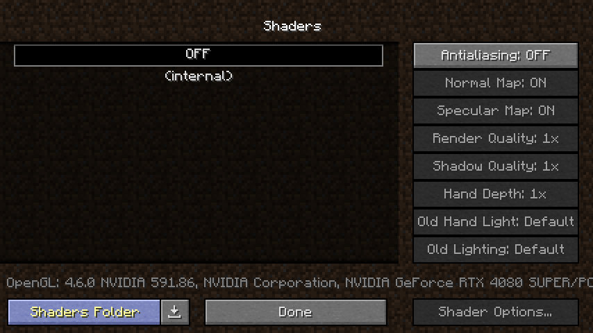
2. Download the latest version of the BSL Shaders shader pack from https://capttatsu.com/bslshaders/, or you can download a shader pack based on BSL Shaders.
3. Place the downloaded shader pack in the `shaderpacks` folder.

## 3. Shader Options

>The following instructions will use the original version of the BSL Shaders pack as a setup guide.

1. Go to Options > Video Settings > Shaders, and select the shader pack. Then click Shading Options.

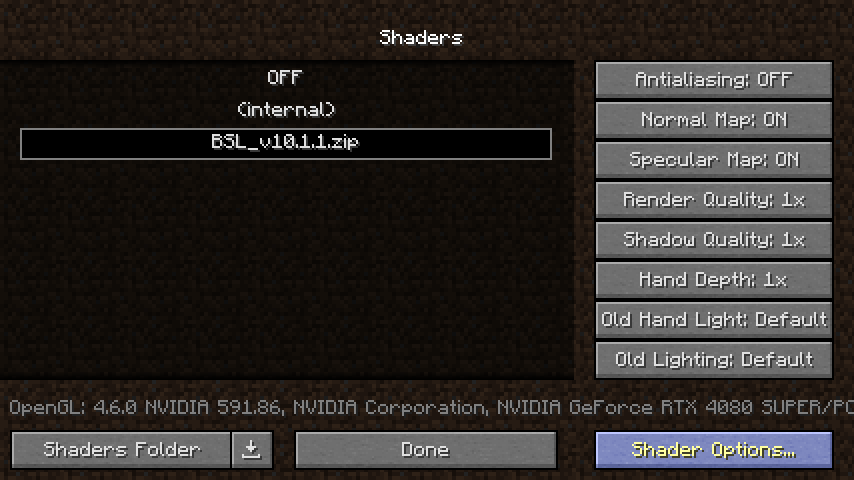

2. Go to Material setting and set `Advanced Materials` to **ON**. And based on the resource pack or mod you have currently installed, note the `Material Format` you are currently using.

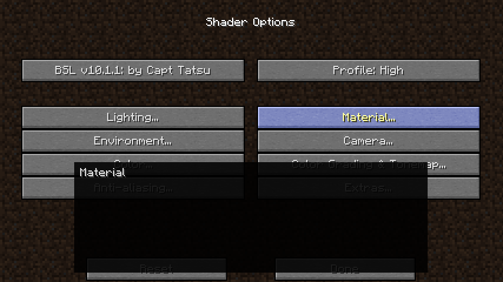
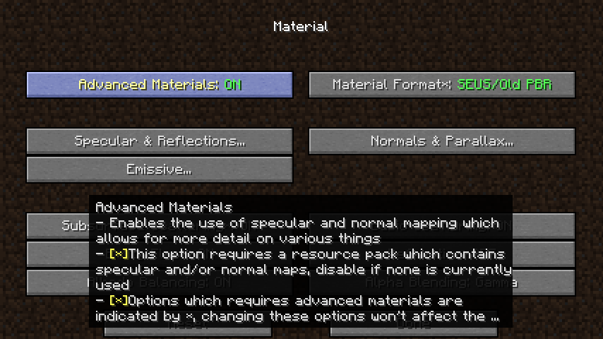

3. If you encounter a situation where the normal map effect is not obvious from a certain perspective in the game, please go to the `Normals & Parallax` settings and set `Normal Dampening` to **OFF**.

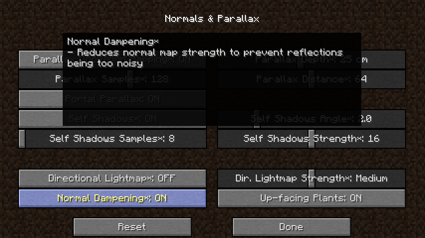

## 4. CRglTF Mod Options
1. Go to the Mods menu on the main screen or the Mods Options in the in-game menu, find and select CRglTF in the mod list, and click Config to enter into glTF settings.

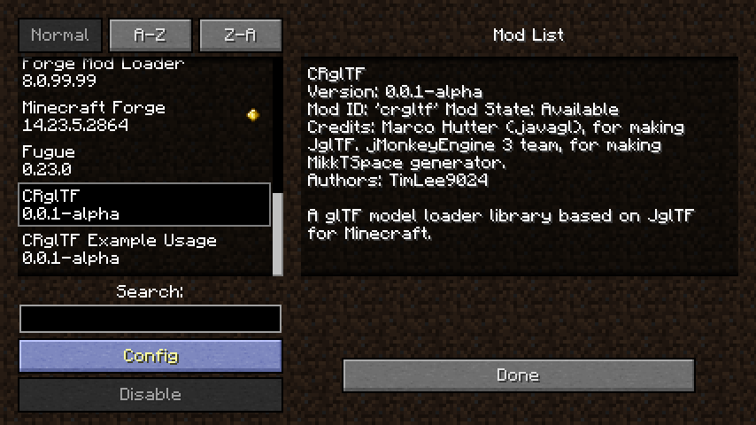

2. Click Open glTF Material Converter Pack Folder to enter into `gltf_material_converter_pack` folder, go to https://github.com/CleanroomMC/glTF-Material-Converter-Pack and download the glTF material converter pack corresponding to the `Material Format` set in the Shader Options, and place the converter pack in the `gltf_material_converter_pack` folder.

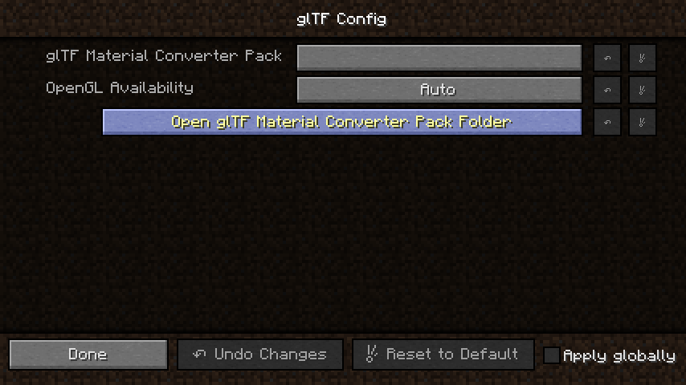

3. Enter into the glTF Material Converter Pack settings, select the converter pack you just downloaded, and press every Done to return to the game.

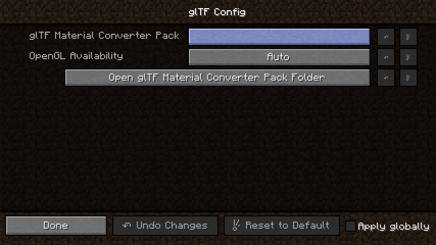
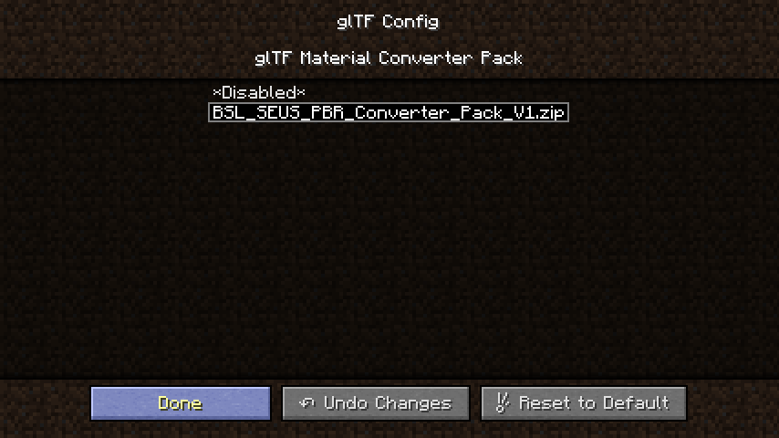

If everything is set up correctly, the PBR  effect will be the same as the sample image below.

### BSL Shaders SEUS/Old PBR result

### BSL Shaders LabPBR 1.3 result
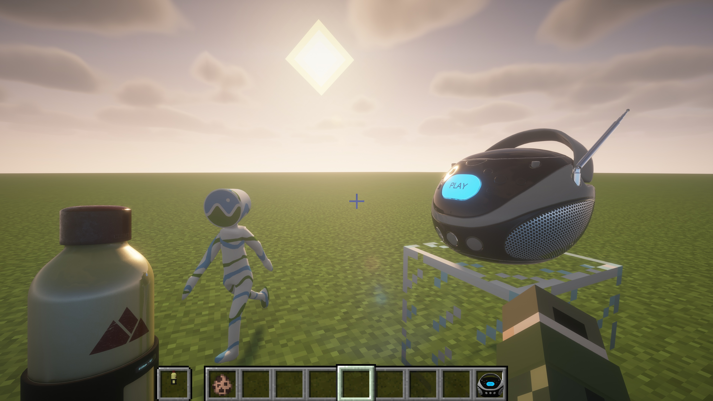

### NG: glTF Material Converter Pack not set
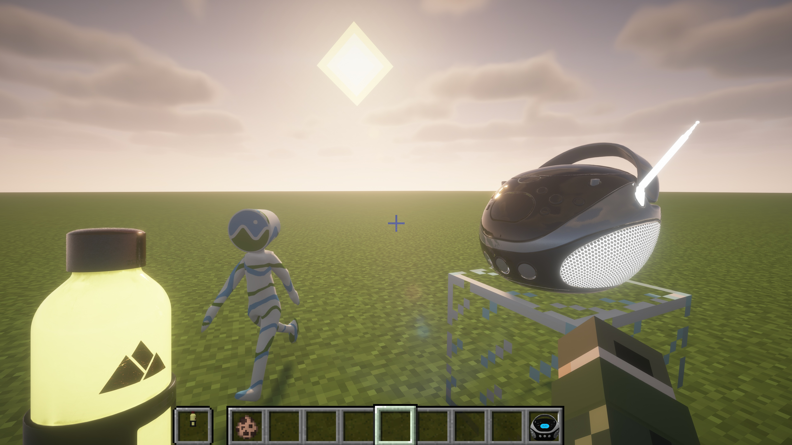
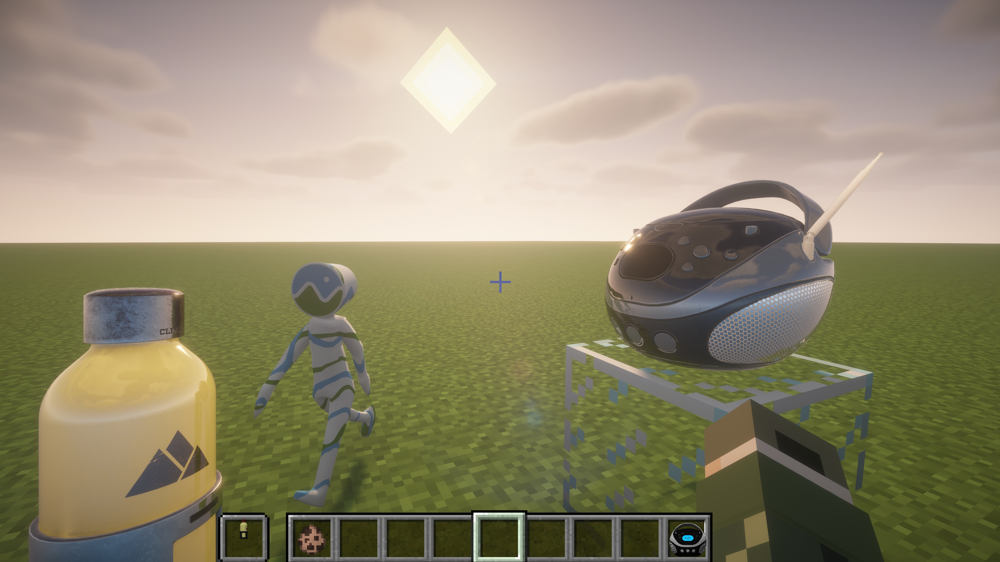

### NG: Using BSL SEUS PBR Converter Pack on LabPBR 1.3 Material Format
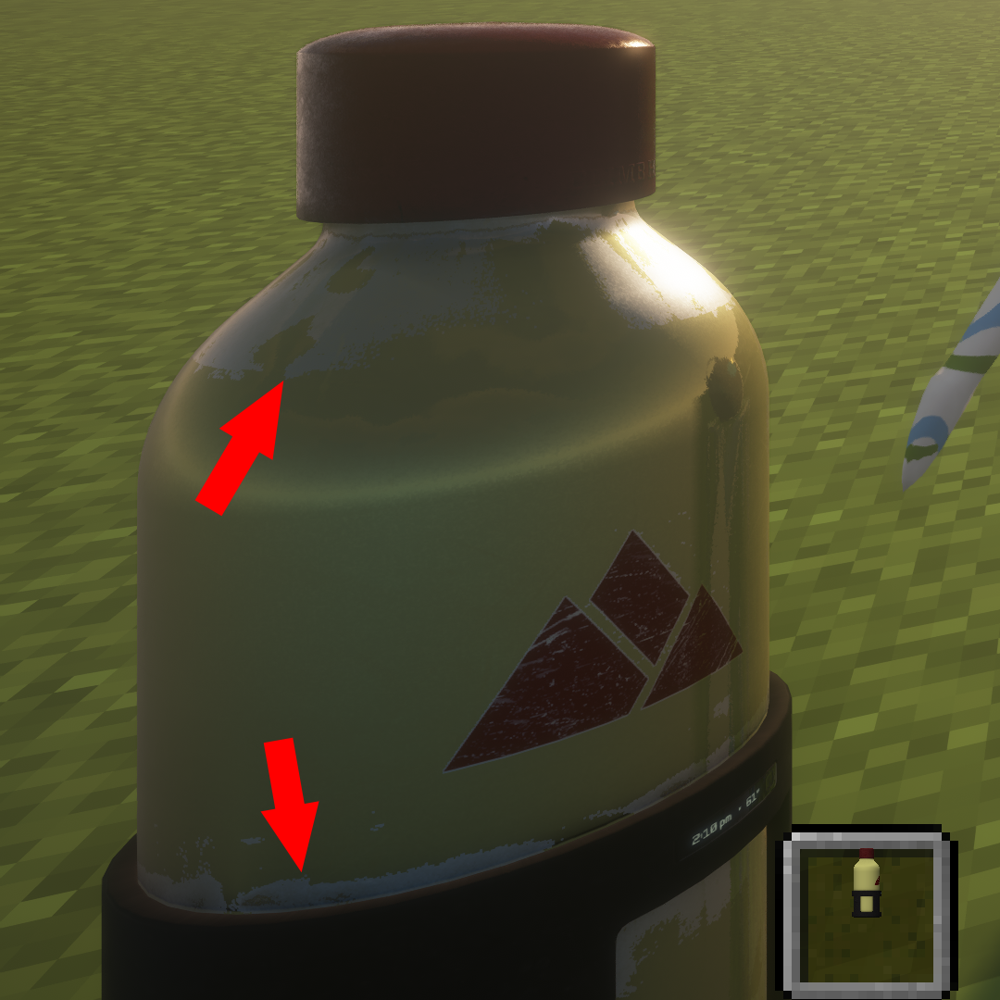